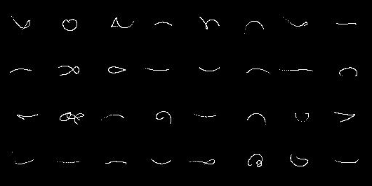
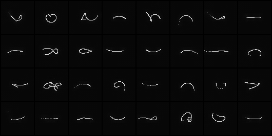

# vqvae
 PyTorch Implementation of VQ-VAE on Coupler Curve Images

## Overview

I implemented a Vector Quantized Variational Autoencoder (VQ-VAE) in PyTorch to train on a dataset of coupler curves that I compiled. The goal was to compare the results between a standard Variational Autoencoder (VAE) and the vector quantized version. While the VQ-VAE produced sharper results compared to the VAE, I did not find any immediate practical applications for it. However, I am providing the code here in case it may be useful to others.

<i>Figure 1: Input Coupler Curves.</i>

<i>Figure 2: Reconstructed Coupler Curves generated by VQ-VAE.</i>

